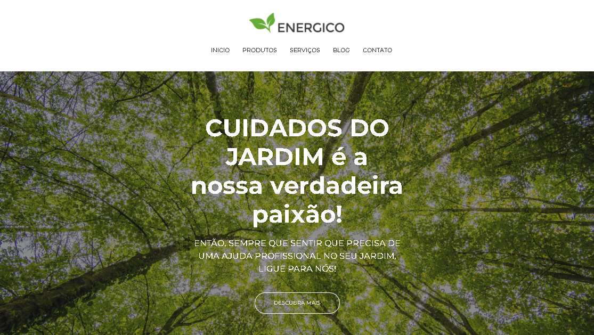
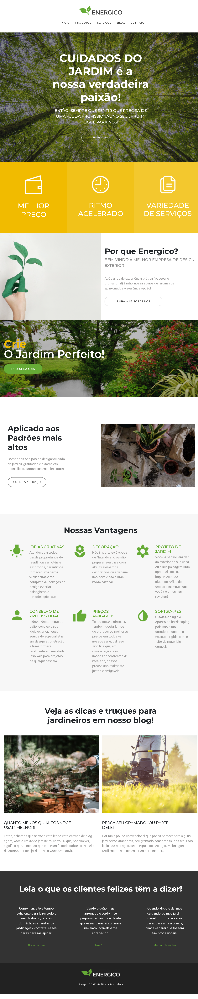

## Landing Page Energico

landing page for energy page presentation

## Technology

Here are the technologies used in this project.

- HTML5
- CSS3
- Bootstrap
- Javascript

## Services Used

- Github
- Netlify

## Getting started

- Dependency

  - Bootstrap

  - To create all the responsive layout it is necessary to install the bootstrap

## How to use

### 1 - Page on large screens

### 2 - Page in responsive mode

## Features

The main features of the application are:

- present a product
- Give information from a blog.

## Links

- Deploy on Netlify:
- Repository:

## Versioning

1.0.0.0

## Authors

- **Bruno Bernardes Guerra**

Please follow github and join us!
Thanks to visiting me and good coding!
